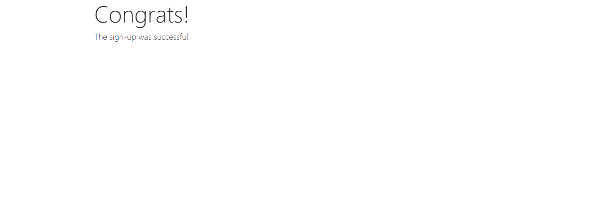
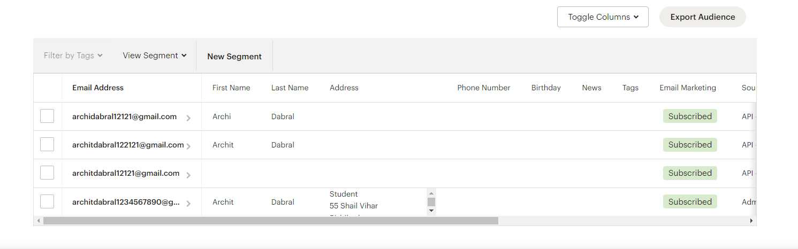

This is a Newsletter Signup based on API valled from https://mailchimp.com/   
<h1>Running the server locally</h1>
   
<h1>Filling in the details</h1>
   
<h1>It's a success and the information send to mailchimp server</h1>
   
<h1>All the mails subscribed can be seen at mailchimp website</h1>
    
